# Hierarchical Planning for Long-Horizon Multi-Agent Collective Construction

Accepted at ICRA 2024!

## Abstract
We develop a planner that directs robots to construct a 3D target structure composed of blocks. The robots themselves are cubes of the same size as the blocks, and they may place, carry, or remove one block at a time. When moving, robots are also allowed to climb or descend a block. A construction plan may thus build a staircase-like scaffolding of blocks to reach other blocks at higher levels. The order of block placement is important; for example, a block that sits atop other blocks must be placed after the blocks below it, and a block that needs scaffolding cannot be placed until after the scaffolding is. Prior works focus on end-to-end approaches that simultaneously plan for block placement order and inter-robot collisions. Larger structures are either intractable or yield high-cost solutions. A prior approach mitigates this by decomposing the structure into smaller components that can be planned for independently, but the computational challenge remains. We present a hierarchical approach that first (1) uses A* to determine a sequence of block placements and removals while ignoring inter-robot collision, then (2) identifies ordering constraints between block placement and removal actions, and finally (3) computes collision-free paths for multiple robots to perform said actions. Compared to an optimization approach that minimizes the number of timesteps to complete the structure, we observe a 100x reduction in computation time for comparable solutions.

## Supplementary Material for ICRA 2024 submission: Experiments and Results
### Test Structures
<table>
  <tr>
    <td align="center"></td>
    <td align="center">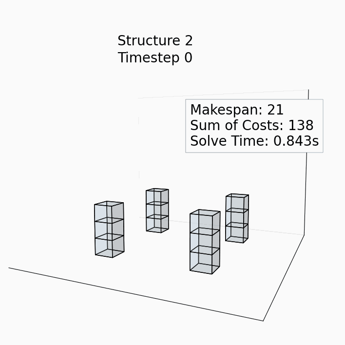</td>
    <td align="center"></td>
      </tr>
  <tr>
    <td align="center"></td>
    <td align="center"></td>
    <td align="center"></td>
  </tr>
  <tr>
    <td align="center">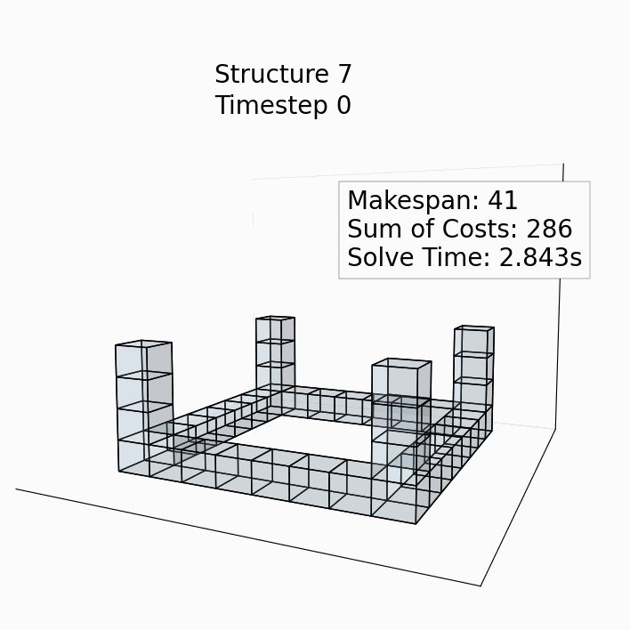</td>
    <td align="center">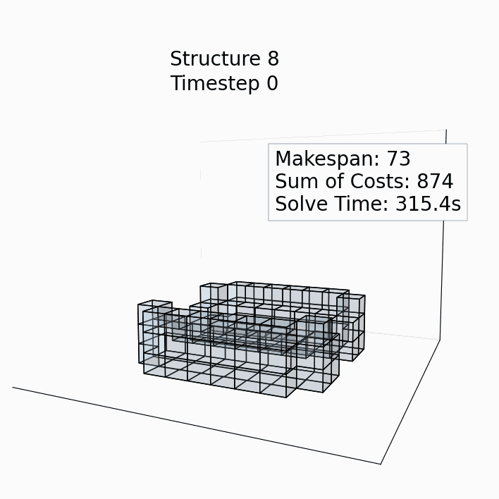</td>
    <td align="center"></td>
      </tr>
  <tr>
    <td align="center">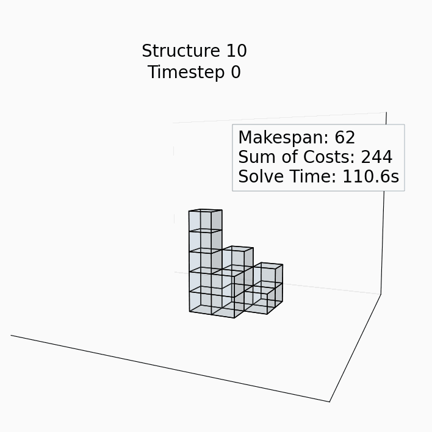</td>
    <td align="center"></td>
    <td align="center">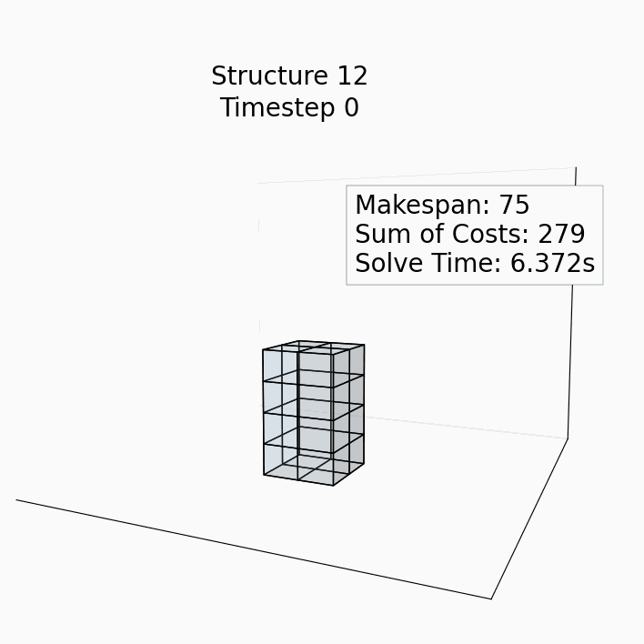</td>
  </tr>
</table>

### Random Structures in Environment Size 7x7x4
<table>
  <tr>
    <td align="center">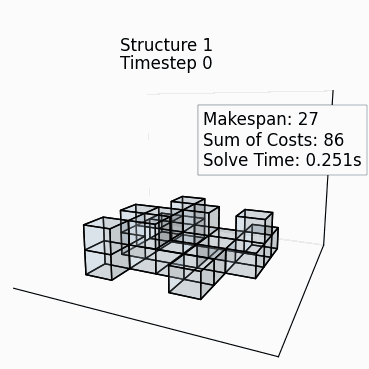</td>
    <td align="center"></td>
    <td align="center">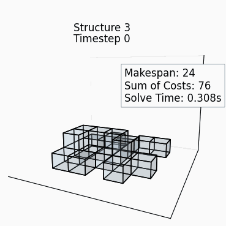</td>
    <td align="center"></td>
    <td align="center">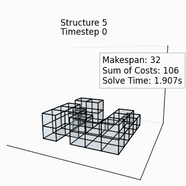</td>
    </tr>
  <tr>
    <td align="center"></td>
    <td align="center"></td>
    <td align="center">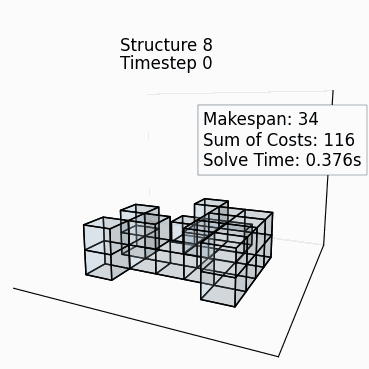</td>
    <td align="center"></td>
    <td align="center">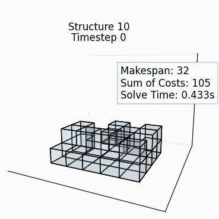</td>
    </tr>
  <tr>
    <td align="center"></td>
    <td align="center">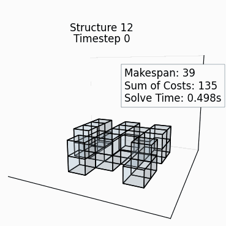</td>
    <td align="center">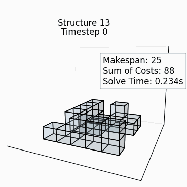</td>
    <td align="center"></td>
    <td align="center">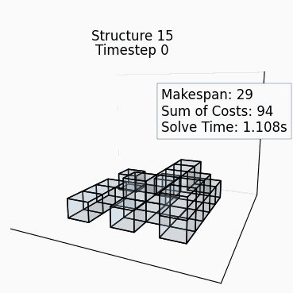</td>
  </tr>
  <tr>
    </tr>
  <tr>
    <td align="center">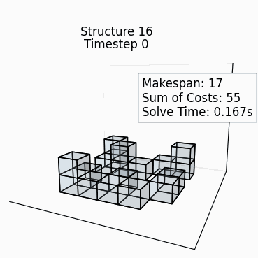</td>
    <td align="center"></td>
    <td align="center"></td>
    <td align="center">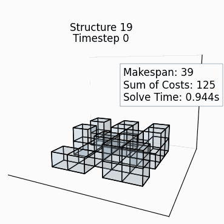</td>
    <td align="center"></td>
    </tr>
  <tr>
    <td align="center"></td>
    <td align="center"></td>
    <td align="center">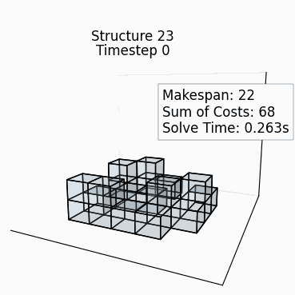</td>
    <td align="center"></td>
    <td align="center"></td>
    </tr>
  <tr>
    <td align="center"></td>
    <td align="center"></td>
    <td align="center">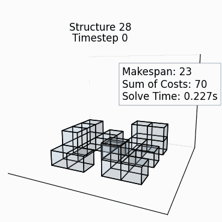</td>
    <td align="center"></td>
    <td align="center"></td>
  </tr>
  <tr>
    <td align="center"></td>
    <td align="center">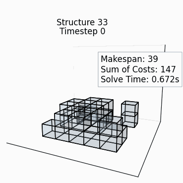</td>
    <td align="center"></td>
    <td align="center">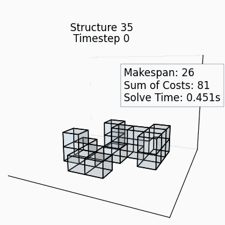</td>
    <td align="center"></td>
  </tr>
  <tr>
    <td align="center"></td>
    <td align="center">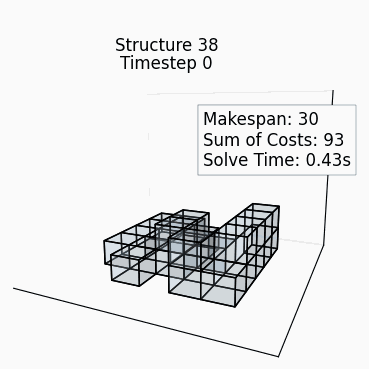</td>
    <td align="center">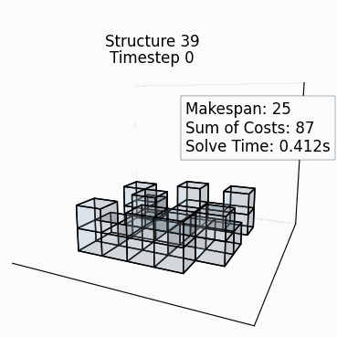</td>
    <td align="center">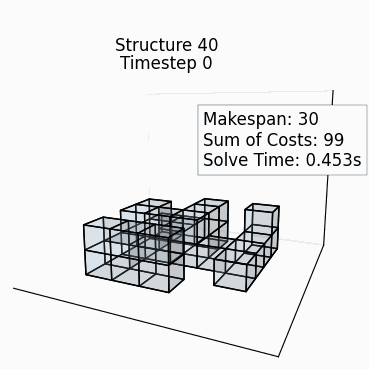</td>
    <td align="center">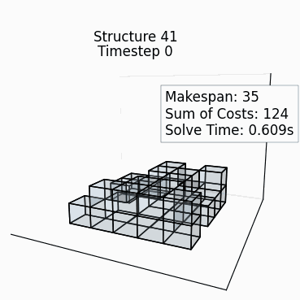</td>
  </tr>
  <tr>
    <td align="center"></td>
    <td align="center"></td>
    <td align="center"></td>
    <td align="center"></td>
    <td align="center"></td>
  </tr>
  <tr>
    <td align="center">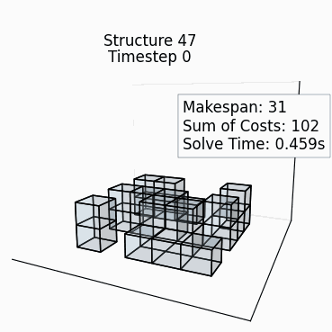</td>
    <td align="center"></td>
    <td align="center"></td>
    <td align="center">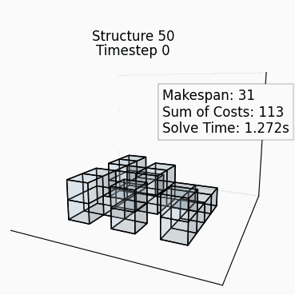</td>
    <td align="center">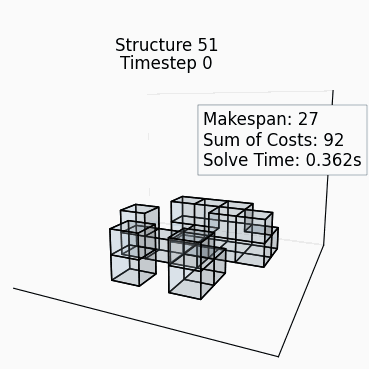</td>
  </tr>
  <tr>
    <td align="center"></td>
    <td align="center"></td>
    <td align="center">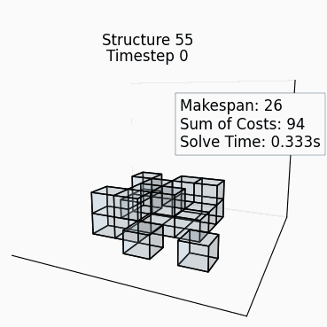</td>
    <td align="center"></td>
    <td align="center">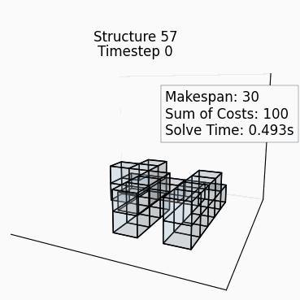</td>
  </tr>
  <tr>
    <td align="center"></td>
    <td align="center">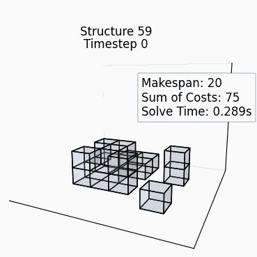</td>
    <td align="center"></td>
    <td align="center"></td>
    <td align="center">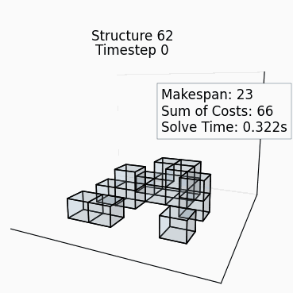</td>
  </tr>
  <tr>
    <td align="center"></td>
    <td align="center"></td>
    <td align="center"></td>
    <td align="center">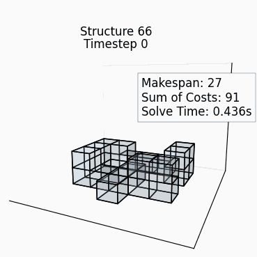</td>
    <td align="center">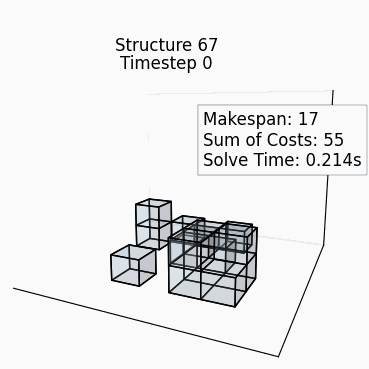</td>
  </tr>
  <tr>
    <td align="center">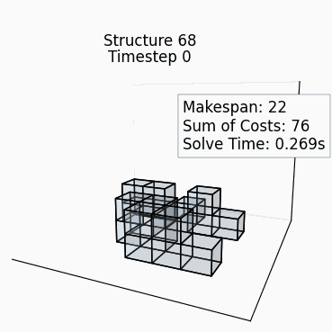</td>
    <td align="center">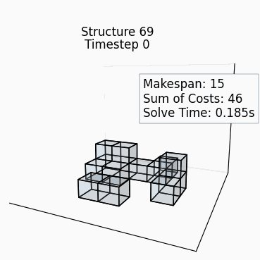</td>
    <td align="center">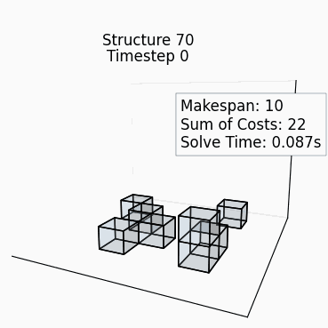</td>
    <td align="center">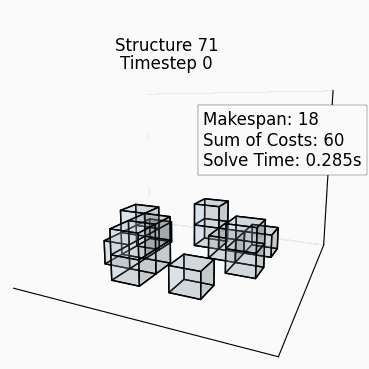</td>
    <td align="center"></td>
  </tr>
  <tr>
    <td align="center"></td>
    <td align="center">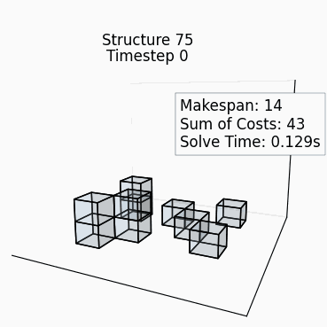</td>
    <td align="center">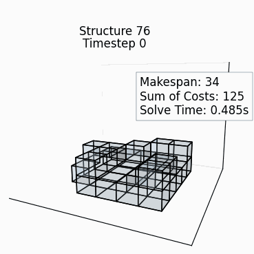</td>
    <td align="center">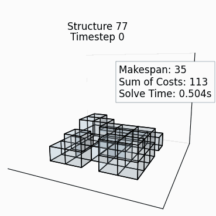</td>
    <td align="center">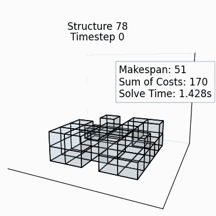</td>
  </tr>
  <tr>
    <td align="center"></td>
    <td align="center"></td>
    <td align="center"></td>
    <td align="center"></td>
    <td align="center"></td>
    </tr>
  <tr>  
    <td align="center">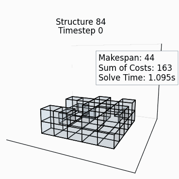</td>
    <td align="center"></td>
    <td align="center">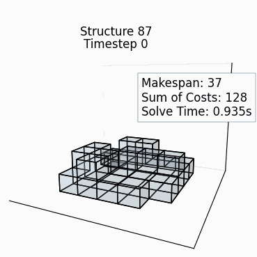</td>
    <td align="center"></td>
    <td align="center"></td>
  </tr>
  <tr>
    <td align="center"></td>
    <td align="center"></td>
    <td align="center">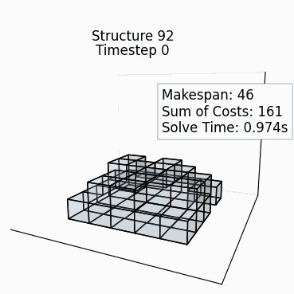</td>
    <td align="center">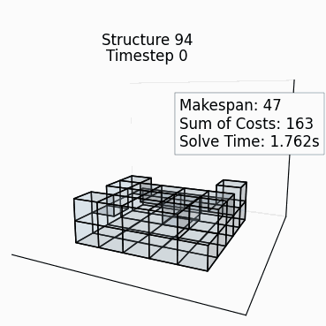</td>
    <td align="center">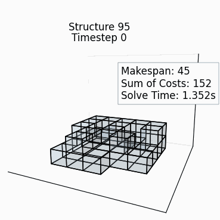</td>
  </tr>
  <tr>
    <td align="center"></td>
    <td align="center">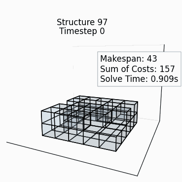</td>
    <td align="center">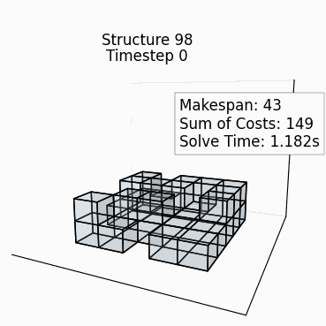</td>
    <td align="center"></td>
    <td align="center">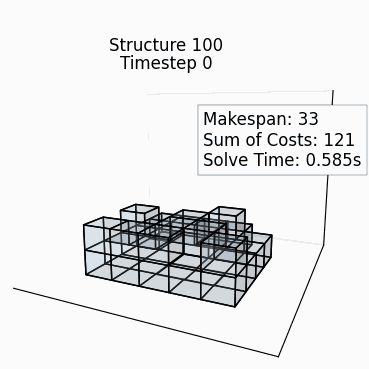</td>
  </tr>
</table>
